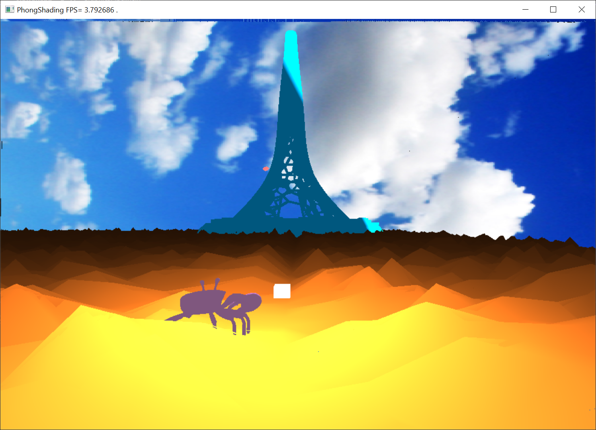

# Software-Renderer
 This is a Software implemented graphics pipeline/ray-tracing system, based on c++ (17) and openframework.

It consists of three independent systems.
### 0. Software Renderer-C++ implemented Graphics Pipeline
> + Load & store  triangle obj meshes (xxx.obj file ), compute per-vertex/ per-face normal if needed.
> + Camera Rotation, Pan moving, Zoom in & Out .
> + Object moving & roation: Arcball controls.
> + Early-Z & Z-buffer technique; Multi-thread rasterization; Gouraud shading/Phong shading;
> + Image texture & Procedural texture: stripe.
> + Procedural landmass: marching cube to generate a random landmass.
> + Skybox.
> + Perspective correct interpolation. 

|Operation  | Instruction | 
| -----| ----- |
| Objects Select |Press R will change the mutable object that is selected. |
| Objects transformation | Keep Shift Pressed to enable model transformation.  Press W, A, S, D and Q, E to Translate in x, y, z direction. Arc-ball rotation with right mouse.Press R(shift+R) to reset its postion. |
|Camera motion | Press W, A, S, D and Q, E to Translate Camera in x, y, z direction. Press Y, U, O, P to rotate in pitch and yaw direction of the camera. |

### 1.1 Implicit surface ray-tracing system  
> + Model transformation:Rotation, Scale, Translate in x, y, z direction, Reset Object position
> + Camera transformation: movement, zoom in zoom out
> + ray-tracing implicit surfaces: sphere,eliptical, plane, triangle, Cone, cube, tetrahedron.
> + small bonus: animation(activate by press KEY V)

### 1.2 TriangleMesh ray-tracing system  
> + Add triangle meshes support into simple ray-tracing system.(Support  xx.obj file )
> + Toggling between Predefined/per-face normal.In runtime, normal are interpolated using the barycentric coordinates.
> + A bounding volume hierarchy to traverse the scene(adaptively split triangles and all mesh objects)(50s/frame->15fps)
> + Implement antialiasing using distribution ray tracing with the stratified super sampling technique.
> + Implement soft shadows using distribution ray tracing
  

### Manual
> for  ray-tracing system First of all you need to use left button of mouse to click to select an object, once this object is selected, it’s color turns to purple, and later instruction all apply to this object. If you want cancel selection, click mid-button of your mouse. 
#### 3.1 Implicit surface ray-tracing ray-tracing system

#### 3.2 Mesh ray-tracing system

|Operation  | Instruction  | 
| -----| ----- |
|Objects transformation| Unfinished |  
| Load/Store 	Models matrix| Unfinished |
| Increase quality| Unfinished |

 
### Environment 
- Windows 10/Linux;
- OpenFrameworks v0.11.0( __latest version has remove this dependency and directly use operating system window API__);
- c++ 17 or higher: STL thread library is used for multi-thread acceleration

### How to setup the code
There are two ways to setup the code:
- 0.__Cmakefile__ is provide for linux. 
- 1.On windows, You can open the corresponding xxxx.sln in vs-studio-project folder (If you have openframeworks with visual studio this should work).

### Reference & Miscs  
- Kaust Beacon obj is provided by Tayyab Mubeen and is downloadable from: https://grabcad.com/library/kaust-beacon-1. For the purposes of this assignment it has been converted to an OBJ file format using the Meshlab software.
- Reference: Fundamental of Computer Graphics IV.
- If you are interesting or have any question please email me or make a issue, I will try my best to help you!

