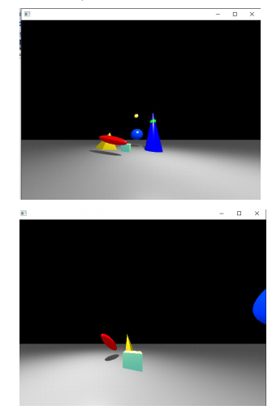
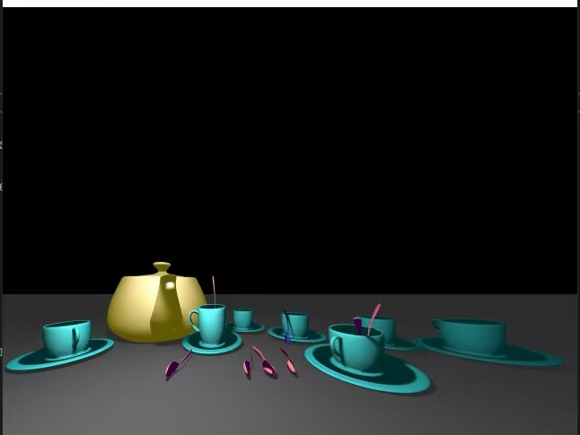
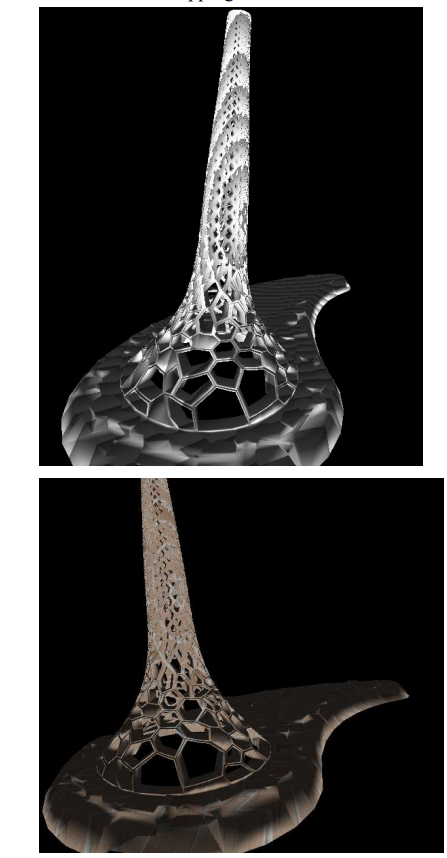

# Software-Renderer
 This is a Software implemented graphics pipeline/ray-tracing system.
### 1.1 Software-implemented simple ray-tracing system  
> + Model transformation:Rotation, Scale, Translate in x, y, z direction, Reset Object position
> + Camera transformation: movement, zoom in zoom out
> + ray-tracing implicit surface: sphere,eliptical, plane, triangle, Cone, cube, tetrahedron.
> + small bonus: animation(activate by press KEY V)

### 1.2 Advanced ray-tracing system  
> + Add triangle meshes support into simple ray-tracing system.(Support  xx.obj file )
> + Toggling between Predefined/per-face normal.In runtime, normal are interpolated using the barycentric coordinates.
> + A bounding volume hierarchy to traverse the scene(adaptively split triangles and all mesh objects)(50s/frame->15fps)
> + Implement antialiasing using distribution ray tracing with the stratified super sampling technique.
> + Implement soft shadows using distribution ray tracing
  
### 2.1 Software-implemented Graphics Pipeline
> + Add triangle meshes support.(Support  xx.obj file )
> + Camera Rotation: Arcball controls
> + Pan moving and Zoom in Operation
> + z-buffer technique;Multi-thread rasterization ;Gouraud shading/Phong shading;
> + Procedural texture: stripe;Image texture.
> + NOTE： perspective correct texture coordinates interpolation is implemnted, but the KAUST_beacon.obj doesn't give the correct texture coordinates, so I am using a parameterization with spherical coordinates.  
### Manual
> for  ray-tracing system First of all you need to use left button of mouse to click to select an object, once this object is selected, it’s color turns to purple, and later instruction all apply to this object. If you want cancel selection, click mid-button of your mouse. 
#### 3.1 Simple ray-tracing system

|Operation  | Instruction  | 
| -----| ----- |
| Objects transformation | Press W, A, S, D and U, J to Translate in x, y, z direction.Press X, Y, Z to Rotation in x, y, z direction. Press R to reset its postion.Press ctrl and into the scale mode, then Press X,Y,Z to Scale in x, y, z direction.(If you want to rotate object now,you need press ctrl to switch back to rotation control mode.)|
|Camera motion |  Press UP, DOWN, LEFT, RIGHT and PAGE_UP, PAGE_DOWN to Translate Camera in x, y, z direction.Press F1 and into the Camera rotation mode, then Press W, A, S, D to rotate in pitch and yaw direction.(If you want to control object motion now, you need press F1 to switch back to object motion control mode.)    |
| Animation  |Press v to start Animation or Click right button of mouse to stop animation  |
#### 3.2 Advanced ray-tracing system

|Operation  | Instruction  | 
| -----| ----- |
|Objects transformation|The Advanced ray-tracing system will change object who is selected one by one, but not as  simple ray-tracing system that you can use mouse to click any object to select that object.Instruction Keys are the same as Simple ray-tracing system|  
| Load/Store 	Models matrix| You can load several Objects into a scene, after you place them well, press F2 to store their model matixes, and you can use F3 to load models'model matixes any time you want. |
#### 3.3 Graphics Pipeline system

|Operation  | Instruction  | 
 | -----| ----- |
 |Camera |  Arcball controls by dragging your mouse/ Scroll your mouse to zoom in or out/ Press W, A, S, D and to Translate Camera|
 | Shading|Press B to switch between Phong shading and Gouraud shading| 
 | Textures| When in Phong shading mode,Press N to switch different Textures(stripe, Image)| 
 
### Environment 
- Windows 10;
- Visual Studio 2017;
- OpenFrameworks v0.11.0;
- Multi-thread Acceleration: With Multi-thread provided by C++11
### How to setup the code
There are two ways to setup the code:
> 1. You can open the corresponding xxxx.sln in vs-studio-project folder (If you have openframeworks with visual studio this should work).
> 2. Or you can create a new openframeworks project in visual studio, and add all the source files into your new project. All the source files are in the /vs-studio-project/assignment1-simple_raytracing/src directoty. 
> 3. In the advanced ray tracing / graphics pipeline/ simple  ray tracing directories, there are xxx.exe that is possible to directly run on your computer and show you this work.
### Reference  
- This is also course assginments from KAUST University: CS-248: COMPUTER GRAPHICS  by prof IVAN VIOLA.
- Kaust Beacon obj is provided by Tayyab Mubeen and is downloadable from: https://grabcad.com/library/kaust-beacon-1. For the purposes of this assignment it has been converted to an OBJ file format using the Meshlab software.
